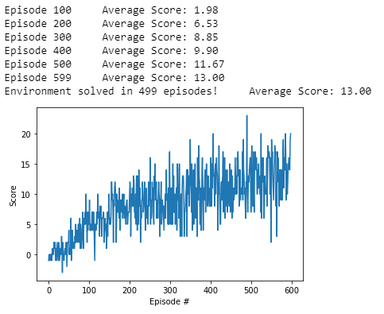

# Project report
This is the report for the banana navigation problem.

## Learning algorithm
The learning algorithm used to solve this problem is standard DQN (Deep Q-Network) same as the the described algorithm in the original paper.
The agent network architecture is as follows:
- Fully connected layer - input : 37 (state size) output 64
- Fully connected layer - input : 64 output 64
- Fully connected layer - input : 64 output is 4 (action size)

Taining parameters used:
- Replay buffer size : 100,000
- Minibatch size : 64 
- discount factor GAMMA : 0.99 
- soft update of target parameters TAU : 1e-3   
- learning rate : 5e-4 
- how often to update the network : 4   

## Training results and plots

## Future work and Imporvments 

1. hyperparameter tunning
2. Using Double Deep Q Networks
3. Using Prioritized Experience Replay
4. Using Dueling Deep Q Networks
5. Implementing the RAINBOW Paper
